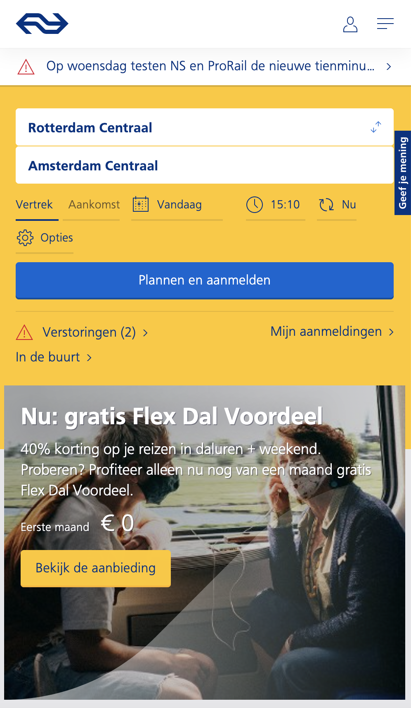
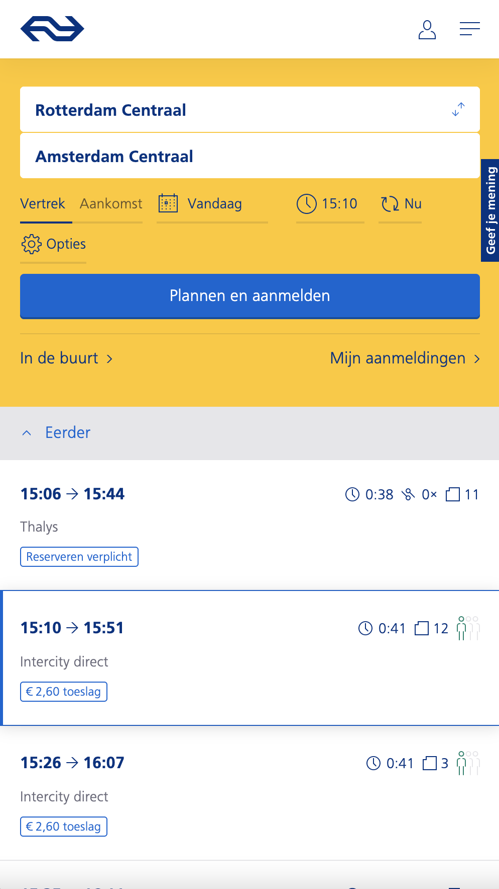
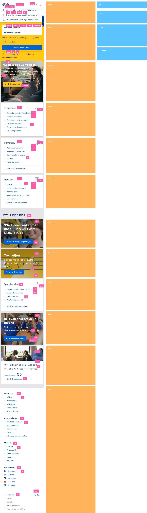
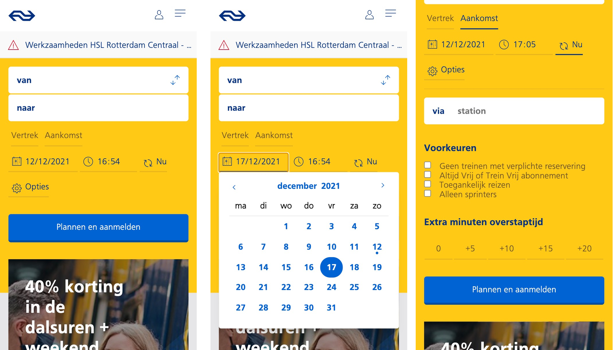
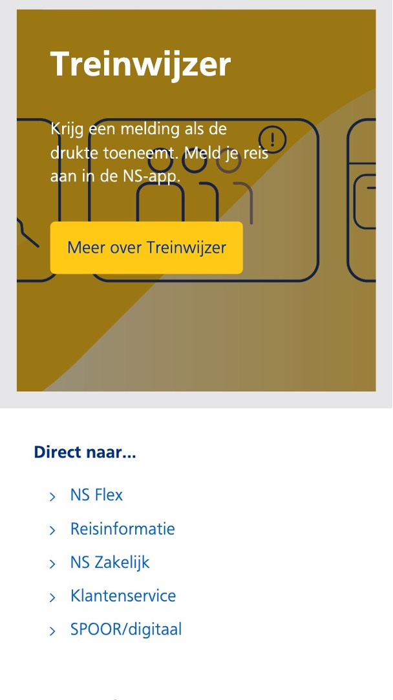
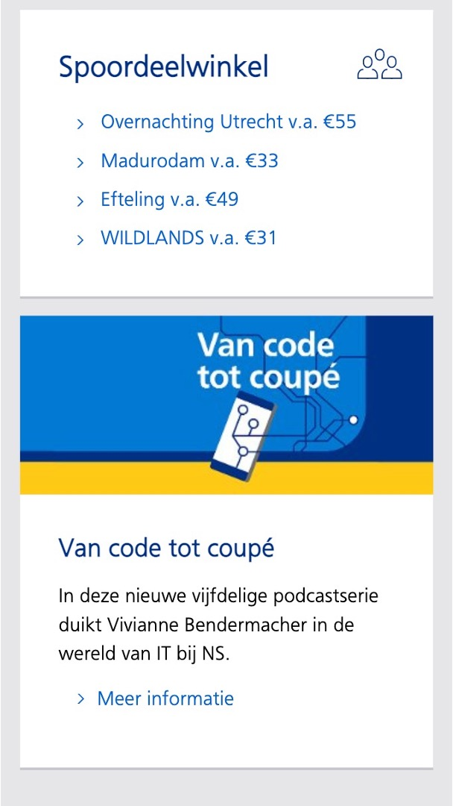

# Procesverslag
Markdown cheat cheet: [Hulp bij het schrijven van Markdown](https://github.com/adam-p/markdown-here/wiki/Markdown-Cheatsheet).

## 1. Jij

### 1.1 Auteur:
Tassilo Vermeulen

#### 1.2 Je startniveau:
Zwart
 
#### 1.3 Je focus:
Extra aandacht voor de Surface Plane/i.o.v.: Formulier uitwerken zoals op NS.nl mobiel.

## 2. Je website

### 2.1 Je opdracht:
[NS website](https://www.ns.nl)
 
#### 2.2 Screenshot(s) van de eerste pagina (small screen): 
hier de naam van de pagina  

#### 2.3 Screenshot(s) van de tweede pagina (small screen):
hier de naam van de pagina  

 

## Breakdownschets (week 1)

### De volledige breakdown analyse van de website: 

## Voortgang 1 (week 2)

### Stand van zaken
Een sterk begin gemaakt aan de website. Het is wel een uitdaging om alles zoveel mogelijk met selectoren te doen. Met de analyse van de website is het basis geraamte opgezet en zijn basis assets neergezet.

### Verslag van meeting
Ik heb geen specifieke punten van aandacht genoteerd. Heb hier en daar andere klasgenoten geholpen. Misschien goed om op te merken: naar mijn idee zijn er geen echte "groepsmeetings" geweest waar we (onderling, als peers) puntsgewijs issues hebben gesproken. Daarom zijn in alle weken deze secties vrij kort. Zoals eerder gezegd heb ik vooral klasgenoten geholpen en zelf research gedaan voor obstakels via internet.

## Voortgang 2 (week 3)

### Stand van zaken
Verder gewerkt aan de website, waar nodig heb ik vragen gesteld over uitvoering van de opdracht aan de docent.

## Toegankelijkheidstest (week 4)

### Bevindingen
Dit vond ik een interessante les, vooral de apparaten (schoksimulator, brillen en bijvoorbeeld de screenreader) gaven een goed beeld van obstakels die mensen met beperkt zicht of lichamelijke beperking ervaren. Dit neem ik niet alleen mee voor dit project, maar ook ander komend werk.

#### Taal niet aangegeven
In de HTML was de taal niet correct aangegeven, hierdoor las de screenreader teksten in het Engels. Opgelost door lang tag toe te voegen aan de HTML-pagina

#### Tabben werkt niet goed
Het tabben door de website werkte niet zoals ik wilde. Dit heb ik opgelost door sommige elementen om te zetten of een tabindex mee te geven.

## Voortgang 3 (week 4)

### Stand van zaken
Geen voortgangsgesprek

## Eindgesprek (week 5)

### Stand van zaken
De website is af! Het was aardig wat werk, en er zijn een hier en daar ook puntjes waar ik niet helemaal uitkwam. Denk aan het verbergen van het label in het aankomst- en vertrekstation-veld. Hoewel dit normaal geen opgave is kreeg ik het niet helemaal voor elkaar. Het feit dat deze opdracht zo focust op het gebruik van selectoren hielp niet. Ja, een semantisch correcte HTML code en CSS stylesheet met veel selectoren is "hoe het hoort". Echter, in de realiteit is het werkelijk niet te doen om in de ontwikkeling selectoren consequent te gebruiken. Veranderingen of toevoegingen in de layout schoppen dan werkelijk alles door elkaar.

Om deze reden heb ik toch een aantal (11 totaal) div's gebruikt in de ontwikkeling van de site. Ik heb waar mogelijk selectoren aangehouden, maar tijdens actieve ontwikkeling werd dit erg frustrerend.

### Screenshot(s)

Een overzicht van de reisplanner. Hier zie je ook de uitgeklapte datumprikker en de extra reisplanner opties die onder een toggle staan.\  
--
\  
Een overzicht van een blok en een deel van de footer\  
--
\  
Een overzicht van een blok met links en een nieuwsitem zoals gebruikelijk op NS.nl\  

## Bronnenlijst

Nb. Wees specifiek ('css-tricks' als bron is bijv. niet specifiek genoeg).

1. 2.2/2.3 Screenshots NS.nl opgehaald 15 nov 21 van www.ns.nl en https://www.ns.nl/reisplanner/#/?vertrek=Rotterdam%20Centraal&vertrektype=treinstation&aankomst=Amsterdam%20Centraal&aankomsttype=treinstation&type=vertrek&tijd=2021-11-15T15:10

2. JS-Datepicker gebruikt om de uitklapbare datumprikker te maken. https://www.npmjs.com/package/js-datepicker

3. Alle andere illustraties/logo's/beelden zijn afkomstig van NS.nl

